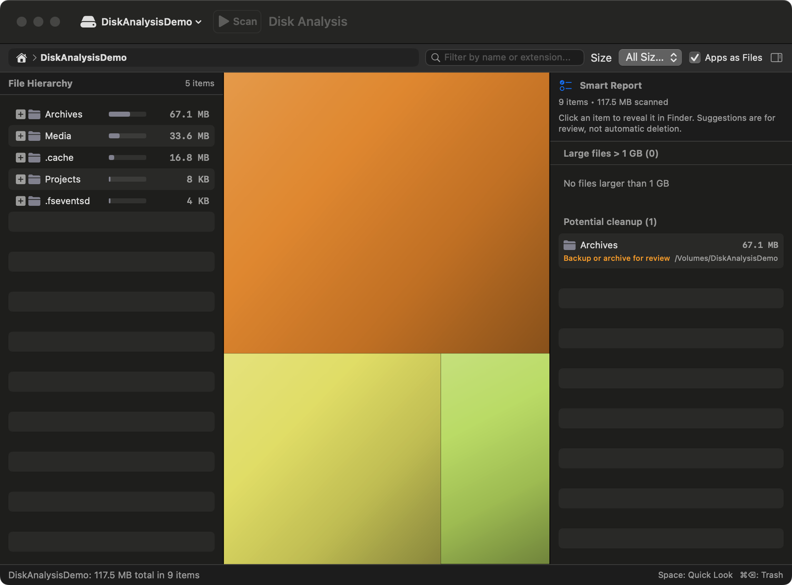
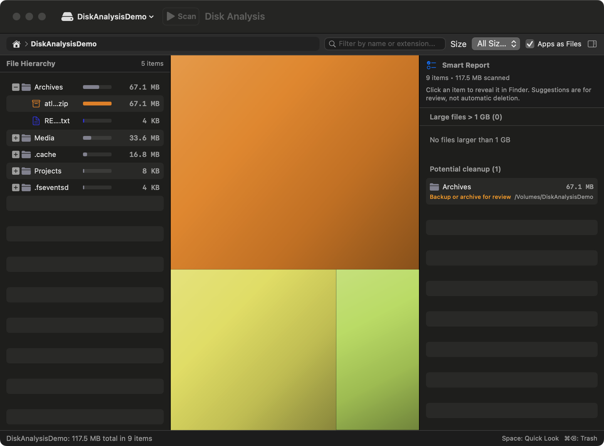

# Disk Analysis

Disk Analysis is a native macOS utility that shows where space is used on a mounted volume or selected folder. It combines a file hierarchy, a cushion treemap, and a report of large files and conservative cleanup candidates.

The app reads local filesystem metadata. It has no network dependency or upload path in this repository.

## Features

- **Bulk directory scanning**: Uses the Darwin `getattrlistbulk(2)` API and a POSIX fallback to read directory metadata in batches.
- **Cushion treemap**: Uses squarified rectangles and cushion shading to show relative disk usage.
- **Three-pane layout**:
  - **Left**: Hierarchical file tree with sizes, usage bars, item counts, and system file icons.
  - **Center**: Interactive treemap with hover details, selection, and folder drill-down.
  - **Right**: Report of large files and conservative cleanup candidates.
- **Selection synchronization**: Selecting an item in either the tree or treemap highlights the same file in both views.
- **Volume management**: Detects mounted volumes and defaults to the macOS data volume when available. You can select an external volume or a folder with the standard open panel.
- **Package handling**: Treats application and library bundles as one item or scans their contents.
- **Search and thresholds**: Filters by name or extension and offers `> 10 MB`, `> 100 MB`, `> 1 GB`, and `> 5 GB` thresholds.
- **Trash-first cleanup**: Moves selected items to the macOS Trash only after confirmation. Protected system paths are blocked.

## Screenshots

These screenshots use synthetic demo data and do not show a personal filesystem.



*Treemap and Smart Report overview.*



*Expanded hierarchy with a generic archive review suggestion.*

## Requirements

- macOS 14 or later
- Swift 6 or later
- No third-party dependencies

## Download v1.0.1

Download `DiskAnalysis-v1.0.1-macos.zip` from the [GitHub Releases page](https://github.com/JPurrier/disk-analysis/releases/latest). Unzip it, move `DiskAnalysis.app` to Applications, and open it.

The release is ad-hoc signed and is not Apple-notarized. If macOS blocks the first launch, Control-click `DiskAnalysis.app`, choose **Open**, and confirm.

## Build and run

Run the app from Swift Package Manager:

```bash
swift run
```

Build an ad-hoc signed application bundle:

```bash
./scripts/build_app.sh
```

The script writes `DiskAnalysis.app` in the repository root. Launch the bundle from Finder or a terminal.

The ad-hoc signature is for local use. It is not an Apple-notarized distribution.

Run the tests:

```bash
swift test
```

Run the public-release check:

```bash
./scripts/check_public_release.sh
```

## Privacy and safety

Disk Analysis scans the location you choose. The default target is the macOS data volume, so the first scan can include your home folder and other local data.

The app can display full paths, open items in Finder, copy paths to the clipboard, show Quick Look previews, and move selected items to the macOS Trash. Review the path and size in the confirmation dialog before you approve a cleanup action.

The source blocks cleanup below protected system locations, including `/`, `/System`, `/usr`, `/bin`, `/sbin`, `/Applications`, and `/private/var`. This is a safety guard, not a replacement for a backup.

The app does not send scan results, filenames, paths, or file contents over the network. macOS may still show its own permission prompts when you access protected folders.

Unreadable directories are skipped by the current scanner, so a scan can be incomplete without listing every permission failure. Treat results as an estimate unless the selected location is readable.

## Project structure

```
Disk_Analysis/
├── Package.swift
├── PRD.md
├── Sources/
│   ├── DiskAnalysis/                                  # App entry point
│   └── DiskAnalysisCore/                              # Scanner, models, layout, and UI
├── Tests/DiskAnalysisTests/                            # Scanner and layout tests
└── scripts/
    ├── build_app.sh                                   # Builds the app bundle
    ├── check_public_release.sh                        # Checks the public source tree
    └── Info.plist                                     # App bundle metadata
```

## Contributing

Read [CONTRIBUTING.md](CONTRIBUTING.md) before opening a pull request. Report security issues through [SECURITY.md](.github/SECURITY.md).

## License

This project is licensed under the MIT License. See [LICENSE](LICENSE).
